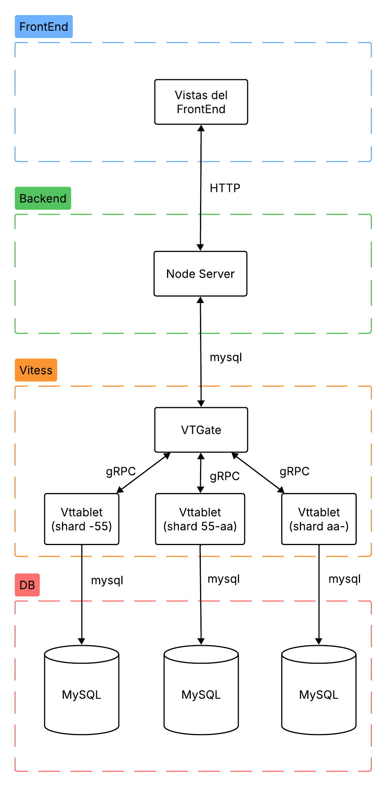

# Fragmentación Horizontal

La fragmentación horizontal es la división de los registros de una tabla en diferentes servidores o nodos. La finalidad de dividir es distribuir la carga, ya que en una aplicación una sola tabla puede tener millones de registros, al dividirlos en diferentes servidores, las consultas, lecturas y escrituras tienen menor latencia, así como un menor consumo de recursos. 
A diferencia con la fragmentación vertical, en los diferentes nodos se tienen las misma columnas pero un menor número de registros (filas).


## Requisitos
Para ejecutar el proyecto se requiere lo siguiente:
- Node version 22.22
- Docker
- Docker Compose

## Instalación de Dependencias

Ejecute el siguiente comando para crear el proyecto y descargar las dependencias necesarias.

```node
npm init -y
npm i
``` 

# Pasos de Ejecución
## 1. Configuración de Vitess


1. Ejecutar contenedores: En el archivo `docker-compose.yml` están descritos los contenedores para ejecutar la capa de Vitess de la aplicación. Este compose contiene 3 nodos, un Vtgate para la conexión de los 3 nodos y herramientas de control y para gestionar la topografía de la red de nodos, esto lo gestiona internamente Vitess, pero es necesario crear los servicios.

``` bash
docker-compose up -d
```

>[!WARNING]
> Antes de proseguir, espere a que todos los contenedores esten arriba, para verificar, espere unos segundos y luego ejecute:
``` bash
docker-compose ps 
```
> Y debería observar que todos tienen un status UP

2. Si es la primera vez que ejecuta el `docker-compose`, entonces tendrá que ejecutar los siguientes comandos, con la finalidad de configurar los shards. Si ya los configuró en una ejecución anterior, por favor continue al siguiente ítem.

Con los siguientes comandos se configuran los shards de forma que interactuen como un cluster y cada uno pueda ejecutar las operaciones sobre los datos de su rango.
``` bash 
docker-compose exec vtctld vtctldclient --server localhost:15999 TabletExternallyReparented zone1-0000000101

docker-compose exec vtctld vtctldclient --server localhost:15999 TabletExternallyReparented zone1-0000000102

docker-compose exec vtctld vtctldclient --server localhost:15999 TabletExternallyReparented zone1-0000000103
```

Luego, es necesario aplicar el esquema, el cual se encuentra en el archivo `schema.sql`. Para ello, ejecute el siguiente comando:
``` bash
docker-compose exec vtctld vtctldclient --server localhost:15999 ApplySchema --sql-file /vt/files/schema.sql repo_software
```

Luego, se deben aplicar las reglas de fragmentación. Para este ejemplo sencillo, se ha decido utilizar una fragmentación a través de un hash en el ID del paquete de software. Por lo tanto, lo que hará ese hash, que no es más que maquinaria matemática que trae internamente Vitess, es transformar el Id en un nuevo valor hexadecimal y luego, el sistema determina a qué segmento pertenece el hash y luego lo envía al shard correspondiente. Vitess utiliza alogritmos que permiten una dispersión uniforme, por lo que los 3 shards utilizados siempre tendrán una cantidad muy similar de registros.

Ejecute el siguiente comando para aplicar el esquema de fraccionamiento, el cuál está descrito en el archivo `vschema.json`.

```bash
docker-compose exec vtctld vtctldclient --server localhost:15999 ApplyVSchema --vschema-file /vt/files/vschema.json repo_software
```

Finalmente, para poblar la base de datos, ejecute el siguiente comando que ejecutará un script de node que llenará con datos aleatorios los diferentes nodos.

``` bash
node seed.js
```

## 2. Iniciar Backend

Ejecute el siguiente comando para ejecutar el servidor backend
``` bash
node server.js
```

## 3. Iniciar FrontEnd

# Descripción del Sistema
## Arquitectura
En el siguiente diagrama se muestra una representación de las diferentes capas de la aplicación y la comunicación entre ellas.


La capa que más nos interesa de este proyecto es la de Vitess. Siendo esta una capa sobre MySQL. En esta aplicación se utilizan diferentes herramientas que dispone Vitess. 
La primera es el VTGate, funciona como un Proxy que intercepta las consultas SQL que genera el backend, luego, realiza diferentes procesos. 

El más importantes es el de encontrar y entablar conexión con el shard correspondiente, para ello, utiliza el Vscheme que le permite aplicar los algoritmos de indexación para los campos, luego, utiliza otras herramientas de Vitess, como TopoServer, el cual le permite encontrar el servidor el rango en el cual vive el registro el cual se quiere operar, luego, envía al VTtablet el comando para la ejecución.

El siguiente componente es el VTtablet, el cual funciona como una capa protectora de la base de datos, su principal función es proteger de comandos maliciosos o mal formados, aquí se envía directamente a la ejecución de Mysql.

Las comunicaciones entre el backend y Vitess es completamente a través del protocolo de Mysql, es decir, para el backend solo existe una base de datos Mysql, totalmente transparente, no existen los fragmentos, los cuales se podrían seleccionar en la consulta a través de insertar una configuración en la consulta. 

En cuanto a la comunicación interna de Vitess, se utiliza gRPC, el cual es un protocolo de comunicación bastante eficiente, que para el programador es totalmente transparente porque se ejecuta internamente, sin embargo, los puertos para dicha configuración se deben establecer, en este caso en el `docker-compose.yml`.

## Descripción de los Enpoints del Backend
A continuación, una breve descripción de los endpoints del servidor backend.

### 1. Crear Paquete
* **Método:** `POST`
* **Ruta:** `/packages`
* **Descripción:** Registra un nuevo paquete en el sistema distribuido. 
* **Lógica Interna:** El servidor genera un UUID v4. Vitess recibe este ID, le aplica un Hash y determina en cuál de los 3 shards debe almacenarse.
* **Request Body (JSON):**
    ```json
    {
      "packageName": "string",
      "packageVersion": "string",
      "packageLicense": "string"
    }
    ```
* **Response (201):** Devuelve el `packageId` generado.

### 2. Listar Todos los Paquetes
* **Método:** `GET`
* **Ruta:** `/packages`
* **Descripción:** Recupera la lista completa de paquetes registrados en todos los shards.
* **Lógica Interna:** Vitess realiza una operación de **Scatter-Gather**, consultando a todos los vttablets en paralelo y fusionando los resultados antes de entregarlos al backend.

### 3. Obtener por ID (con Localización de Shard)
* **Método:** `GET`
* **Ruta:** `/packages/:id`
* **Descripción:** Busca un paquete específico y audita su ubicación física.
* **Lógica Interna:** Tras obtener el dato, el servidor escanea los metadatos de la topología para confirmar si el registro vive en el Shard `-55`, `55-aa` o `aa-`.
* **Response (200):**
    ```json
    {
      "mensaje": "Enrutamiento exitoso",
      "shard_ubicacion": "nombre-del-shard",
      "datos": { ... }
    }
    ```

### 4. Actualizar Paquete
* **Método:** `PUT`
* **Ruta:** `/packages/:id`
* **Descripción:** Actualiza la información de un paquete existente.
* **Importante:** Requiere el ID en la URL para que Vitess pueda realizar un enrutamiento de "punto único" (Point Lookup) hacia el shard correspondiente.

### 5. Eliminar Paquete
* **Método:** `DELETE`
* **Ruta:** `/packages/:id`
* **Descripción:** Elimina un paquete del clúster.

---

## Endpoints de Infraestructura (Sharding)

### 6. Consultar Shard Específico
* **Método:** `GET`
* **Ruta:** `/shard/:name`
* **Descripción:** Permite inspeccionar el contenido de una partición física específica ignorando el enrutamiento global.
* **Valores aceptados para `:name`:** `-55`, `55-aa`, `aa-`.